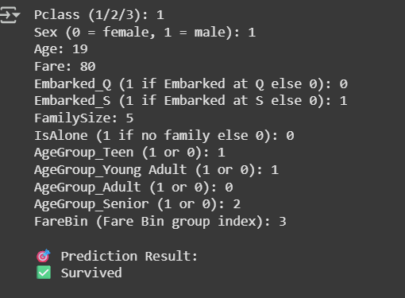

🚢 Titanic Survival Prediction
A Machine Learning Project for CodSoft Data Science Internship

---

📌 Project Overview

This project aims to predict whether a passenger survived the Titanic disaster using machine learning. It is developed as Task 1 under the CodSoft July Batch - Data Science Internship.

---

📁 Folder Structure

CODSOFT-DataScience-Internship/
├── Task_1_Titanic/
│ ├── Titanic_EDA_Model.ipynb
│ ├── titanic.csv
│ ├── model_output.png
│ └── README.md

---

🧠 Workflow & Task Structure

1. 📚 Data Loading – Loaded the Titanic dataset ('titanic.csv')
2. 🧹 Data Cleaning – Handled missing values in columns like Age, Embarked, and Fare
3. 📊 Exploratory Data Analysis (EDA) – Used visualizations to understand patterns and distributions
4. 🧪 Feature Engineering – Created new meaningful features:
   - FamilySize (SibSp + Parch + 1)
   - IsAlone (binary flag for no family)
   - Binned Age into categories like Teen, Adult, etc.
   - Binned Fare into 4 groups
   - One-hot encoding for Embarked and AgeGroup
5. 🤖 Model Building – Built and evaluated two models:
   - Logistic Regression
   - Random Forest Classifier ✅ (Best performing)
6. 📈 Model Evaluation – Accuracy, Confusion Matrix, and Classification Report
7. 🧮 Prediction Output – Collected user input and predicted survival.

---

✨ Key Features Engineered

- FamilySize = SibSp + Parch + 1
- IsAlone = 1 if no family aboard, else 0
- AgeGroup = Categorical (Teen, Young Adult, Adult, Senior)
- FareBin = Binned fare into 4 categories
- Embarked & AgeGroup one-hot encoded

---

🧩 Final Features Used in Model

['Pclass', 'Sex', 'Age', 'Fare', 'Embarked_Q', 'Embarked_S',
'FamilySize', 'IsAlone', 'AgeGroup_Teen', 'AgeGroup_Young Adult',
'AgeGroup_Adult', 'AgeGroup_Senior', 'FareBin']

---

🏆 Top 5 Insights from EDA

1. 👩‍🦰 Females had a higher survival rate than males.
2. 💼 1st class passengers had better chances of survival.
3. 👪 Passengers with family survived more than those alone.
4. 👶 Younger age groups had higher survival rates.
5. 🚢 Port of Embarkation influenced survival, with 'C' having a higher survival rate.

---

🔍 Model Performance

✅ Random Forest Classifier (Best Model)
- Accuracy: ~83%
- Classification Report: Shows good precision/recall balance
- Confusion Matrix: Good prediction on both classes (0 and 1)

---

💡 Sample Prediction

Based on the following input:

- Pclass: 1
- Sex: Male
- Age: 19
- Fare: 80
- Embarked: Q (0), S (0)
- FamilySize: 5
- IsAlone: 0
- AgeGroup: Teen
- FareBin: 3

🎯 **Prediction Result**: ✅ Survived

---

🧠 Learnings

- Understanding data preprocessing and EDA
- Importance of feature engineering
- Evaluating multiple models
- Using Scikit-learn effectively
- Deploying with Streamlit (optional)

---

📅 Internship Info

- Internship Program: CodSoft – Data Science Internship
- Batch: July 2025
- Task: Titanic Survival Prediction
- Student: Sreesanth S.

---

🙌 Acknowledgment

Thanks to [CodSoft](https://www.codsoft.in/) for this opportunity to build and showcase data science projects.

