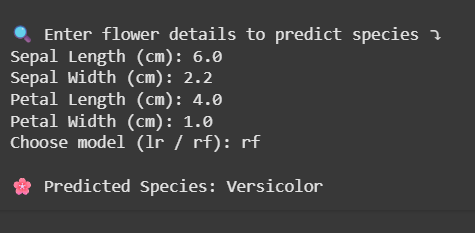

# 🌸 Iris Flower Classification  
A Machine Learning Project for CodSoft Data Science Internship (Task 3)

---

## 📌 Project Overview  
This project aims to classify iris flowers into three species — *Setosa*, *Versicolor*, and *Virginica* — based on four features:  
- Sepal Length  
- Sepal Width  
- Petal Length  
- Petal Width  

This classification task was completed under the **CodSoft August Batch - Data Science Internship**.

---

## 📁 Folder Structure  
CODSOFT/
├── Task_3_IRIS/
│ ├── IRIS.csv
│ ├── Task3_Iris.ipynb
│ ├── user_prediction.png
│ └── README.md

---

## ⚙️ Workflow Steps  

### 📥 Step 1: Importing Required Libraries  
- Imported `pandas`, `matplotlib`, `seaborn`, `sklearn` modules.  

### 📊 Step 2: Load Dataset  
- Loaded the iris dataset using `pandas.read_csv()`.  

### 🔍 Step 3: Exploratory Data Analysis  
- Checked dataset structure, shape, null values, and unique class counts.  

### 🧹 Step 4: Data Preprocessing  
- Renamed columns for clarity.  
- Verified class distribution.  

### ✂️ Step 5: Feature and Label Separation  
- Separated features (`X`) and label (`y`).  

### 📚 Step 6: Train-Test Split  
- Split data into training (80%) and testing (20%) sets.  

### 🧠 Step 7: Model Training  
- Trained **Logistic Regression** and **Random Forest Classifier**.  
- Achieved **100% accuracy** on the test set using both models.  

### 🔮 Step 8: User Input-Based Prediction  
- Accepted manual input for Sepal and Petal dimensions.  
- Predicted and displayed the iris species.  

---

## 🖼️ Sample Prediction Output

Below is a screenshot of a successful user-input-based flower classification prediction:

---

## 🎓 Outcome  
Both models performed exceptionally well with high accuracy due to the clean and balanced nature of the Iris dataset. The interactive prediction section adds a practical edge to the project.

---

